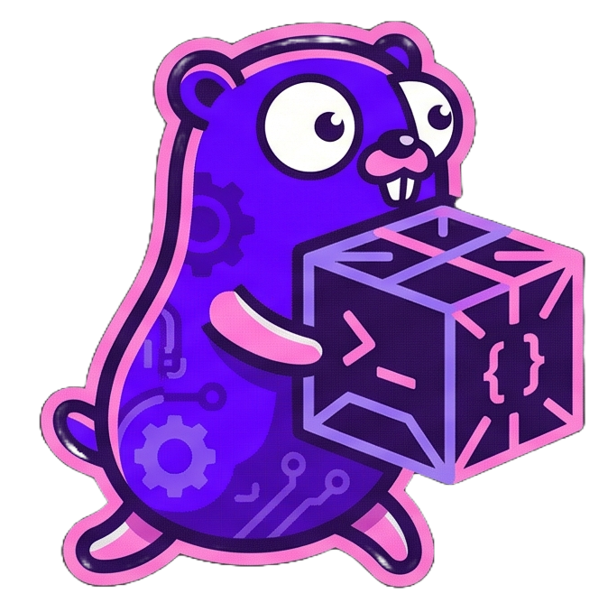

# Courier



✨Just like Postman, but in your terminal!✨

Are you the kind of person who does not want to leave the terminal just to test an API? Me neither.

Courier is a terminal UI HTTP client built with Bubble Tea. It lets you compose requests (method, URL, headers, and body), send them, and inspect response headers/body without leaving your shell.

## Run Courier

### Prerequisites

- Go 1.25+

### Start directly

```bash
go run ./cmd
```

### Or build a binary

```bash
go build -o courier ./cmd
./courier
```

## Basic controls

- `Tab` / `Shift+Tab`: move between panes
- `Ctrl+O`: cycle request method
- `Ctrl+S` or `Enter`: send request
- `Ctrl+C`: quit
